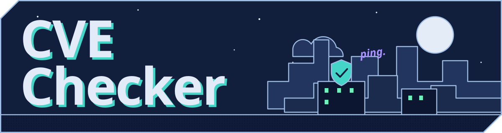
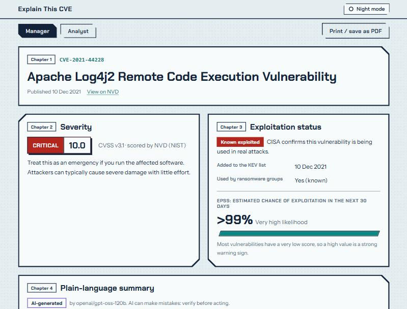

<h1></h1>

[](https://github.com/Lectrik0/explain-this-cve/actions/workflows/tests.yml)

A one-page brief for any **CVE**: how severe it is, whether attackers are using it, which products are affected and what to do. There is a Manager view and an Analyst view.
Live at https://explain-this-cve.vercel.app

It is a static page and one serverless function. No accounts, no database, no build step and no dependencies.



<details open>
<summary><h2>The problem</h2></summary>

A CVE record is written for specialists. A manager who has to decide "do we drop everything today?" gets a score, a vector string and 100 reference links. An analyst gets the same data but has to open three sites to answer the question that matters: is anyone actually exploiting this? This page combines three free public sources and answers it in one place.

</details>

<details open>
<summary><h2>What you get</h2></summary>

Seven chapters, always in this order:

1. CVE ID, title and published date
2. Severity: the CVSS score with a colour badge, and the level written as a word
3. Exploitation status: CISA Known Exploited Vulnerabilities (KEV), the EPSS probability, and CISA's triage answers (SSVC: is it exploited, can attacks be automated, how much control does the attacker get)
4. Plain-language summary, written by an AI model when a key is set and by fixed rules otherwise
5. Affected products and versions
6. Fix and mitigation: what CISA requires, first unaffected versions, patches and advisories
7. References

Every brief says "Always verify with the official vendor advisory."

</details>

<details>
<summary><h2>How it works</h2></summary>

```
 Browser (public/)                Vercel function (api/cve.js)             Public data
 +-----------------+   GET        +--------------------------------+
 | index.html      | -----------> | 1  method check                |
 | app.js          |  /api/cve    | 2  rate limit, per client IP   |
 | styles.css      |  ?id=CVE-..  | 3  validate the CVE ID         | ---> NVD API 2.0
 +-----------------+              | 4  cache lookup                | ---> CISA KEV feed (cached)
        ^                         | 5  fetch the sources in        | ---> FIRST EPSS API
        |                         |    parallel, with timeouts     |
        |  small fixed JSON       | 6  normalise untrusted data    | ---> LLM provider
        +------------------------ | 7  summary: AI or template     |      (key read from env)
                                  +--------------------------------+
```

NVD is required. If NVD is down, the page shows the last good answer for that CVE as a labelled saved copy when one exists, and an error when it does not. If CISA, EPSS or the AI model fails, the page still works and says what is missing. "Could not check CISA's list" is shown as unknown, never as "not exploited". The study guide [docs/HOW-IT-WORKS.md](docs/HOW-IT-WORKS.md) walks through every file and the full request flow.

</details>

<details>
<summary><h2>Security</h2></summary>

The data comes from public databases, but anyone can influence some of it, and an AI model reads it. All of it is treated as hostile.

| Control | How it's done here |
|---|---|
| API keys | Read from environment variables in one server file (`api/cve.js`). The browser code never mentions them. `.env*` is git-ignored, `.env.example` holds names only, and a test scans every committed file for key-shaped strings. Errors carry a source name and a category, never a URL, header or upstream text. |
| Input validation | The CVE ID must match `^CVE-\d{4}-\d{4,10}$` (ASCII only, length checked first). Exactly one query parameter, `id`, is accepted, so a visitor cannot invent endless URLs for one CVE. |
| SSRF | The only visitor input that reaches another server is the validated ID. The three API hosts are constants, the ID goes in through `URL.searchParams`, and redirects are refused. |
| XSS | The server cleans text, caps lengths and allow-lists tags. The browser writes only with `textContent`, takes CSS classes from fixed tables, and re-checks every link (http and https only). |
| Content Security Policy | `default-src 'none'`. Scripts, styles, fonts and connections load only from this site. No inline scripts or styles. `require-trusted-types-for 'script'` with `trusted-types 'none'`, so Chromium refuses `innerHTML` and any policy created to bypass it. Plus HSTS, `nosniff`, `no-referrer`, `frame-ancestors 'none'`. |
| Prompt injection | The model gets only public facts, no tools and no secrets. Facts go in as escaped JSON inside `<facts>` tags. The answer must be a three-field JSON object, normalised and rejected if it has a link, tag, backtick, or any version number or domain-like name that is not in the facts. A rejected answer becomes the template summary. |
| Rate limiting and caching | 20 requests a minute per client, 6 uncached lookups a minute per client, and a shared budget just under NVD's own limit. Answers are cached for an hour (two minutes if a source failed). Concurrent requests for one CVE share a single lookup. IPv6 clients are limited per /64. |
| Failing honestly | If NVD is down or slow, the last good answer for that CVE is shown with a clear "saved copy" notice and its original time, instead of an error. KEV and EPSS outages show as "unknown" or "unavailable". A KEV feed with fewer than 100 entries is treated as broken, so an empty feed never reads as "nothing is exploited". |
| Hostile upstream data | Every field is type-checked, every loop and size is capped, tags are allow-listed, and a record about a different CVE than the one asked for is refused. The SSVC answers must be one of a few exact words, and the sentences shown for them are written in the page, not taken from the data. |
| Supply chain and CI | No dependencies. Tests run on every push in GitHub Actions with a read-only token, no secrets, and both actions pinned to a full commit SHA. |
| Reporting | `/.well-known/security.txt` (RFC 9116) and `SECURITY.md` say how to report a problem, through GitHub's private reporting. |
| No third parties | Fonts are self-hosted (SIL OFL). The page makes no request to any other domain. |

</details>

<details>
<summary><h2>Tested</h2></summary>

There are more than 140 tests, run by GitHub Actions on every push, on saved real API responses, so they run offline. The XSS drill runs the real `app.js` against an API response with an `` or `<script>` payload in every field, inside a DOM stand-in that throws on any HTML write, and checks that no unexpected element, attribute, link or class appears. I confirmed the drill works by running it against two deliberately broken copies of `app.js`: both fail. On the live site I checked the headers, that server files and `.env.local` return 404, and that rapid requests get a 429. While testing the real model I saw it turn the range ">= 2.0.1 and < 2.3.1" into "2.0.1 to 2.3.0" and invent "2.14.9". The version check caught that.

</details>

<details>
<summary><h2>Known limitations</h2></summary>

- The cache, the saved copies and the rate limiter live in the memory of one function instance. Vercel creates and recycles instances, and `vercel dev` reloads the function on every request. They are best-effort: a saved copy may not exist when NVD fails, and the Vercel firewall rule is the limit to rely on.
- The per-IP limit trusts the `x-real-ip` header, which is only trustworthy behind Vercel.
- NVD's quota is shared by all visitors. Several clients together can use it up, and the page then shows a "busy" message.
- Groq's free tier allowed about 8,000 tokens a minute for this model in October 2026. A burst of new lookups falls back to the template summary.
- A persuaded AI model can still write a misleading sentence that has no link, version or domain in it. The checks cannot catch an opinion, which is why severity, KEV and EPSS are shown separately from structured data.
- NVD data is sometimes late or incomplete, and the product list is grouped and ordered by a heuristic, so it can include third-party products that embed the affected library.
- KEV lists confirmed exploitation only, and EPSS is a probability, not a verdict.
- CISA's triage answers (SSVC) exist only for CVEs that CISA has assessed. When they are missing, the page says so. I show the three answers and not CISA's final decision, because that decision depends on facts about your own organisation.
- Trusted Types is enforced in Chromium browsers. I tested one Chromium browser, in both themes, at desktop and phone widths. I did not test Safari or Firefox.

</details>

<details>
<summary><h2>Run it</h2></summary>

You need Node.js 24 and the Vercel CLI (`npm install -g vercel`). Nothing else.

```
copy .env.example .env.local
npm run dev
```

Fill in `.env.local` first if you want the AI summary or the higher NVD limit, then open http://localhost:3000. `npm run dev` loads that file and starts `vercel dev` in local mode, so no Vercel project is created. `npm test` runs the tests. `npm run live-check` does one real lookup (`npm run live-check -- CVE-2024-3094` for another). Neither prints the value of any variable.

All settings are environment variables, read on the server only:

```
LLM_BASE_URL   any OpenAI-compatible chat API, for example https://api.groq.com/openai/v1
LLM_API_KEY    the provider key; leave empty to use the template summary
LLM_MODEL      for example openai/gpt-oss-120b
NVD_API_KEY    optional; raises NVD's limit from 5 to 50 requests per 30 seconds
```

The AI summary needs all three LLM variables, and changing provider means changing those three values, not code. I used Groq's free tier for its quota and speed. Gemini's free tier was ruled out because Google's terms allow only paid services for apps offered in the EEA, the UK and Switzerland.

To deploy, import the repository in Vercel (framework "Other", no build command), add the four variables under Settings, Environment Variables, and add one firewall rate-limit rule for `/api/cve`. The firewall rule runs before the function and is the limit that holds when instances change.

</details>

<details>
<summary><h2>Next</h2></summary>

- Nessus plugin IDs: show which Tenable Nessus plugins detect a CVE, so an analyst can go from a scanner finding to this brief and back. It needs a source for the CVE to plugin mapping, a new source module with its own failure handling, and a new chapter on the page.
- A rate limit and cache in a shared store such as Vercel KV or Upstash, which removes the per-instance limits above.
- More sources, such as GitHub security advisories and OSV.
- Paste a list of CVE IDs from a scan export and get one combined brief.

</details>

<details>
<summary><h2>Credits</h2></summary>

Data from the [NVD API](https://nvd.nist.gov/) (this product uses data from the NVD API but is not endorsed or certified by the NVD), the [CISA Known Exploited Vulnerabilities catalog](https://www.cisa.gov/known-exploited-vulnerabilities-catalog) and [FIRST EPSS](https://www.first.org/epss/). Fonts: Chakra Petch and Instrument Sans (SIL Open Font License, copies in `public/fonts`). The look comes from my [portfolio site](https://lectrik0.github.io).

</details>

Built with AI assistance; I designed the features and security requirements and reviewed and tested all code.
